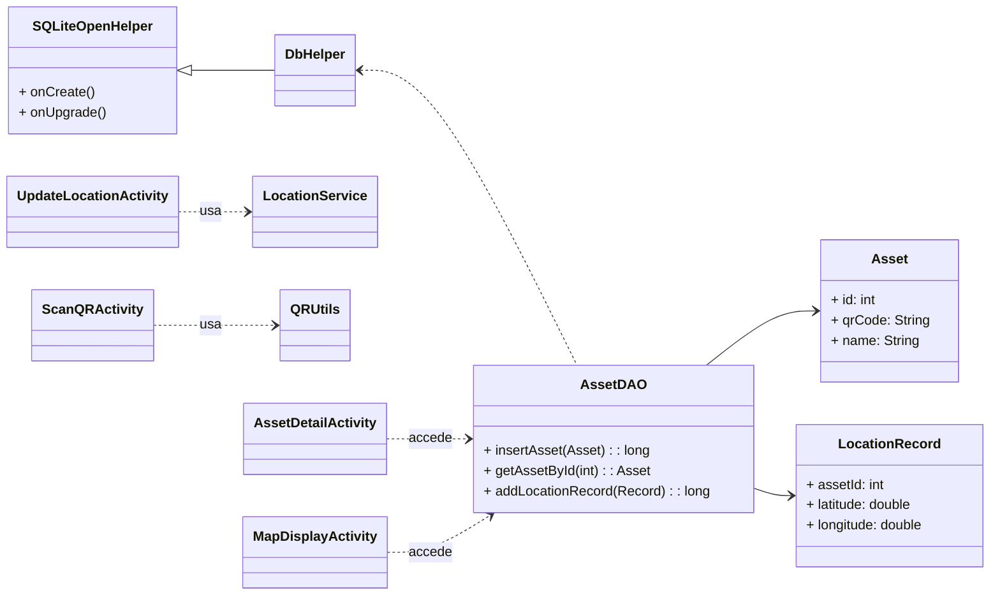

# AddQR - Gestión de Inventario y Activos 

Este proyecto es una aplicación móvil nativa para Android diseñada para la gestión de inventario y el seguimiento de activos utilizando códigos QR. Cumple con los requisitos EV3 (Entorno de Verificación 3) para una aplicación completa basada en Java y SQLite.

## 👥 Repositorio y Autores

| Elemento | Detalle |
| :--- | :--- |
| **Rama Principal** | `main` |
| **Rama de Desarrollo** | `development` |
| **Usuario/Equipo** | *BenjaminAPP* |
| **Autor Líder / Creador** | **Benjamin** - Desarrollo completo, arquitectura, lógica y testing. |

## 🛠️ Requisitos Técnicos 

La aplicación está configurada con las siguientes especificaciones:

  * **Lenguaje:** Java
  * **Base de Datos:** SQLite nativa de Android.
  * **Actividades:** 10 Activities distintas para cubrir el flujo completo.
  * **Funcionalidad Hardware (2):**
      * *Cámara:* Escaneo de códigos QR para identificación y validación de activos.
      * *GPS/Ubicación:* Registro de la ubicación geográfica al mover o actualizar un activo.
      * *(Nota: El micrófono y el calendario no se usan en este alcance, se prioriza QR/GPS por la temática de inventario).*
  * **API Externa (1):** Integración con una API de Mapas Estáticos (ej. Google Maps Static API) o Geocoding para visualizar la última ubicación registrada de un activo.
  * **SDK Mínimo:** API 24 (Android 7.0 Nougat) o superior.

## Flujo de la Aplicación y 10 Activities

El flujo se centra en el ciclo de vida de un activo, desde su registro hasta su seguimiento de ubicación.

| \# | Activity | Descripción y Flujo | Hardware/API |
| :--- | :--- | :--- | :--- |
| **1** | `MainActivity` | Menú principal y acceso rápido a funciones clave. | N/A |
| **2** | `ScanQRActivity` | Captura de Imagen/Cámara. Inicia el escáner QR para identificar un activo y redirige a *AssetDetailActivity*. | **CÁMARA** |
| **3** | `NewAssetActivity` | Formulario para registrar un activo nuevo en la BD. Genera un QR único. | N/A |
| **4** | `AssetListActivity` | Lista completa de todos los activos en el inventario. | N/A |
| **5** | `AssetDetailActivity` | Muestra la información completa de un activo, su estado y su última ubicación. Contiene el botón para "Mover Activo". | GPS (disparado) |
| **6** | `UpdateLocationActivity` | Funcionalidad de Hardware (GPS). Actividad dedicada a obtener la ubicación actual (Lat/Lon) y guardarla como un nuevo registro en la BD. | **GPS** |
| **7** | `LocationHistoryActivity` | Muestra la lista cronológica de todos los movimientos de un activo específico. | N/A |
| **8** | `EditAssetActivity` | Formulario para modificar los datos de un activo existente. | N/A |
| **9** | `MapDisplayActivity` | Integración API. Muestra la última coordenada registrada del activo utilizando un servicio de mapas externo. | **API Externa** |
| **10** | `SettingsActivity` | Permite configurar parámetros de la aplicación, como la clave de la API de Mapas. | N/A |

## 🏗️ Ingeniería y Arquitectura

La arquitectura sigue el patrón **Modelo-Vista-Controlador (MVC)**, separando claramente las responsabilidades.

### 1\. Directorio `ui` (Views/Activities)

Contiene las 10 Activities definidas arriba y los adaptadores necesarios para mostrar listas (ej. `AssetAdapter`).

### 2\. Directorio `data` (Persistencia SQLite)

Centraliza la gestión de datos.

  * **Modelos (`Asset`, `LocationRecord`):** Objetos de datos.
  * **`DbHelper`:** Hereda de `SQLiteOpenHelper`, responsable de crear (`onCreate`) y actualizar (`onUpgrade`) la estructura de las tablas (`Assets` y `LocationRecords`).
  * **`AssetDAO` (Data Access Object):** Contiene los métodos CRUD (`insertAsset`, `getAssetById`, `addLocationRecord`, etc.) para interactuar con la BD de forma segura.

### 3\. Directorio `service` (Hardware/API)

  * **`LocationService`:** Clase de utilidad que abstrae la complejidad de la obtención de coordenadas GPS, utilizada por la `UpdateLocationActivity`.
  * **`QRUtils`:** Utilidad para inicializar el escáner QR (usando librerías externas como ZXing).
    
### Diagrama de Clases (UML) 
### Diagrama de Flujo (Actividades)
    
### Diagrama de Clases (Simplificado)

### Diagrama de Secuencia: Registro de Ubicación (Hardware GPS)

-----
