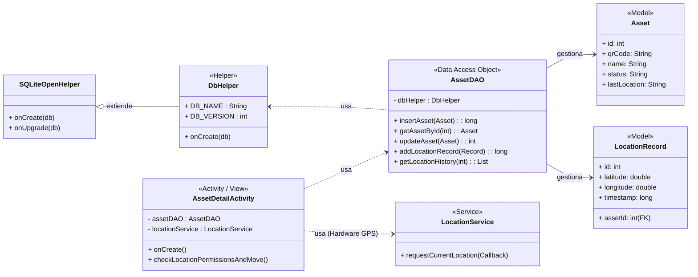
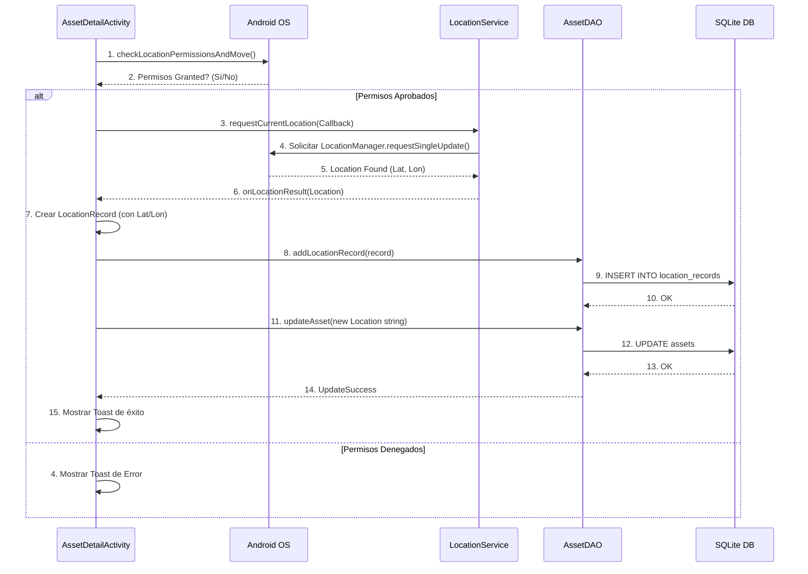

Aquí tienes la documentación de Ingeniería y Arquitectura para tu proyecto **Asset Hunter PRO (AddQR)**, incluyendo el diseño, diagramas de clases, flujo y secuencia, presentada en un formato de documento técnico.

-----

# 📄 Documentación de Ingeniería y Arquitectura: Asset Hunter PRO (AddQR)

## 1\. Diseño de la Aplicación (Visual y UX) 🎨

El diseño prioriza la **usabilidad en entornos de trabajo**, utilizando un esquema de color de alto contraste conocido como **Asset Hunter PRO (Modo Oscuro)**.

| Aspecto | Detalle | Justificación |
| :--- | :--- | :--- |
| **Tema** | **Asset Hunter PRO (Modo Oscuro)** | Profesional, moderno y de alto contraste, ideal para entornos de trabajo (escanear códigos en almacenes, etc.). |
| **Paleta** | **Fondo:** Azul Marino Oscuro (`#15202B`). **Primario (Acción):** Naranja Neón (`#FF8C00`). **Secundario (Informativo):** Azul Brillante (`#00A3FF`). **Contraste:** Blanco (`#FFFFFF`). | El **Naranja Neón** se usa exclusivamente para botones de acción crítica (**Escanear, Guardar/Mover GPS**) para asegurar la visibilidad y usabilidad. |
| **Estructura**| Diseño Basado en **Tarjetas (CardView)** | Mejor legibilidad de la información de los activos en el detalle y formularios, separando visualmente los bloques de datos del fondo. |
| **Navegación**| **Principal:** Menú lineal en `MainActivity`. **Pie de página:** Botones discretos para Acceso Rápido/Configuración (API). | Mantiene la sencillez del flujo principal (**Escanear -\> Detalle**) mientras ofrece acceso rápido a funciones secundarias. |

-----

## 2\. Diagrama de Clases (UML) 🧱

Este diagrama representa las clases principales del sistema (**Modelos**, **Persistencia** y **Servicios**) y sus relaciones, siguiendo una arquitectura Modelo-Vista-Controlador (MVC).



-----

## 3\. Diagrama de Flujo (Actividades) 🔄

Este diagrama ilustra el flujo de navegación principal y las transiciones entre las Activities para la gestión de un activo.

```mermaid
graph TD
    A[MainActivity (Menú Principal)] --> B(btn_scan_qr);
    A --> C(btn_add_new_asset);
    A --> D(btn_view_list);
    
    B --> E[ScanQRActivity (Cámara)];
    E -- QR Code --> F{Activo Existe?};
    
    F -- Sí --> G[AssetDetailActivity (ID)];
    F -- No --> H[NewAssetActivity (QR precargado)];
    
    C --> H;
    H -- Guardar --> D;
    
    D --> I[AssetListActivity (Lista)];
    I -- Seleccionar --> G;
    
    G -- btn_move_asset --> J[UpdateLocationActivity (Hardware GPS)];
    G -- btn_view_on_map --> K[MapDisplayActivity (API Mapas)];
    G -- btn_edit_asset --> L[EditAssetActivity];
    
    J -- Guardar GPS/Actualizar --> G;
    L -- Guardar/Eliminar --> I;
```

-----

## 4\. Diagrama de Secuencia (Funcionalidad de Hardware: GPS) 📍

Este diagrama detalla la interacción paso a paso para el registro de una nueva ubicación mediante el hardware **GPS**, siendo un proceso asíncrono crucial para la funcionalidad de seguimiento.


